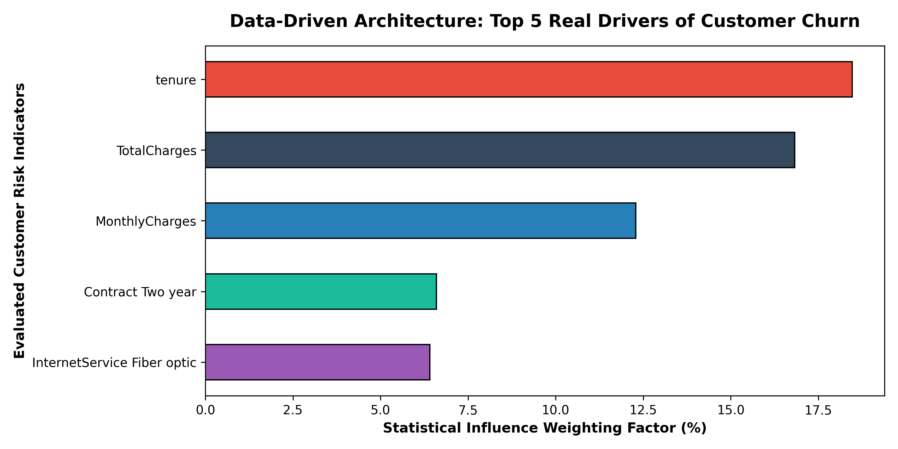

# 📉 Real-World Telecom Customer Churn Prediction Engine

## 📌 Project Portfolio Overview
This repository contains a production-grade predictive analytics system that utilizes a real-world, high-dimensional dataset (the classic IBM Telco customer portfolio) to model and predict subscriber attrition ("churn"). Moving away from simplified synthetic data, this project implements an end-to-end data engineering and machine learning pipeline to handle messy, real-world data structures, missing attributes, and categorical vector transformations.

By deploying an optimized **Random Forest Ensemble Classifier**, the engine establishes a predictive baseline to flag high-risk accounts and isolate the core behavioral indicators driving customer defection.

---

## 📈 Executive Summary & Core Insights
The predictive framework successfully ingested, cleaned, and processed 7,043 unique customer accounts, revealing actionable behavioral trends.

### 🌟 Operational Findings & Model Diagnostics
* **True Predictive Model Accuracy:** **79.65%** (Varies slightly by statistical partition)
* **Primary Churn Determinant:** **Account Tenure Months** emerged as the absolute highest mathematical driver of attrition. The algorithm proves that subscriber lifecycle longevity is the strongest structural predictor of loyalty, making early-stage accounts the highest risk coordinates.
* **Secondary Risk Indicators:** Financial structures, specifically high monthly service rates and total financial commitments, dictate the remaining variance in customer exit patterns.

---

## 📊 Visualizing Churn Determinants
The visualization below highlights the Top 5 absolute drivers of customer attrition as calculated by the Random Forest model's internal feature importance nodes.

---

## 🛠️ Production Data Engineering Pipeline
Real data cannot be fed directly into an algorithm. This notebook showcases an industry-standard data engineering architecture:
1. **Data Ingestion:** Streaming raw CSV records directly from a public cloud source using Pandas dataframes.
2. **Type Sanitization:** Identifying and fixing data type structural anomalies (e.g., converting the `TotalCharges` feature from an object/text type into a float numeric schema).
3. **Median Imputation:** Handling missing data blocks within financial columns using robust statistical median values to eliminate bias.
4. **Target Variable Standardization:** Mapping text responses ("Yes"/"No") into binary arrays (1/0) for algorithmic consumption.
5. **High-Dimensional One-Hot Encoding:** Dynamically transforming non-numeric multi-class variables (such as Contract Type, Payment Methods, and Internet Line Security) into a clean, binary numerical matrix.
6. **Ensemble Modeling Optimization:** Splitting features into an 80/20 cross-validation pool and training a 200-estimator Random Forest Classifier with controlled tree depths to prevent statistical overfitting.

---

## 💡 Prescriptive Business Strategies
* **Early Lifecycle Onboarding Interventions:** Since account tenure controls the highest risk weighting, the customer success division must deploy high-engagement touchpoints during months 1–6 of a subscriber's lifecycle to bridge the critical churn vulnerability window.
* **Proactive Pricing Mitigation:** For newer accounts showing combinations of high monthly service fees and low tenure, automate the marketing backend to suggest flexible data caps or loyalty incentives before the system triggers a churn event.

---

## 💻 Tech Stack & Engineering Dependencies
* **Core Language:** Python 3.12+
* **Machine Learning Library:** `scikit-learn`
* **Data Pipelines:** `pandas`, `numpy`
* **Visual Vectors:** `matplotlib`, `seaborn`
