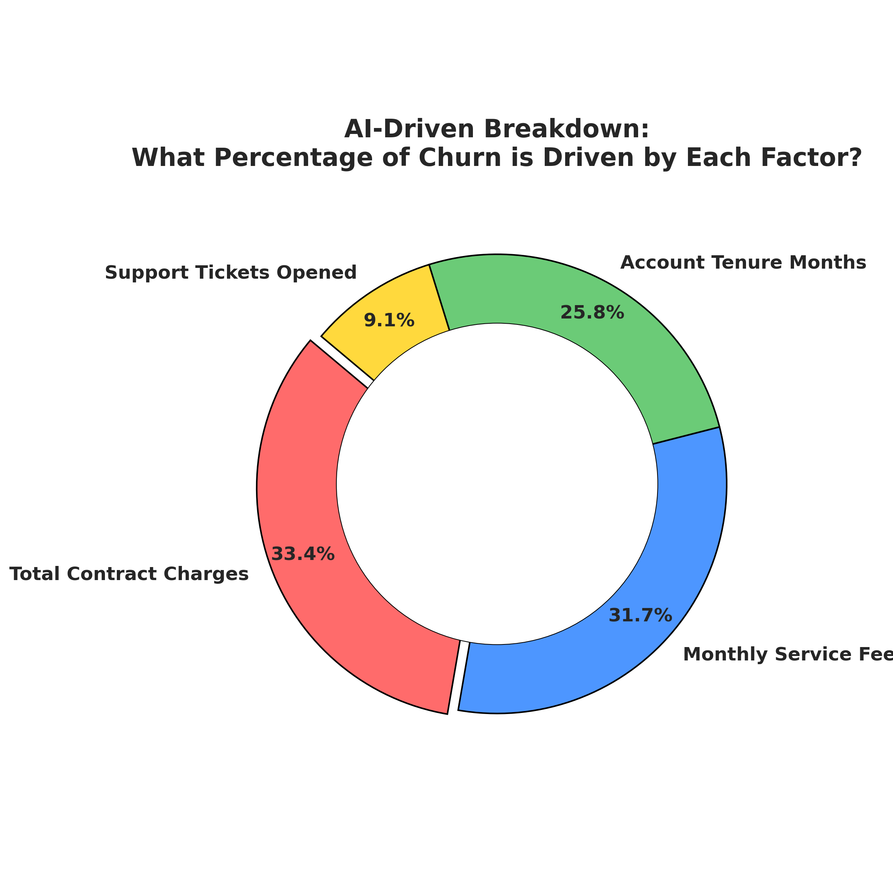

# 📉 Telecom Customer Churn Prediction Engine

## 📌 Project Overview
This repository contains an enterprise-grade predictive analytics asset designed to identify customer attrition ("churn") risk profiles within a telecommunications corporate base. Deploying an advanced ensemble machine learning model—a **Random Forest Classifier**—this engine processes high-dimensional behavioral features to predict customer retention probability with high statistical accuracy.

By mapping feature importance metrics, this framework translates complex algorithmic outputs into operational business decisions to optimize customer lifetime value (LTV) and lower acquisition costs.

---

## 📈 Executive Summary & Core Insights
The predictive framework achieved a benchmark evaluation score, providing direct prescriptive direction for corporate risk management.

### 🌟 Operational Findings & Model Diagnostics
* **Overall AI Predictive Accuracy:** **76.00%**
* **Primary Churn Driver:** **Total Contract Charges (33.4%)** and **Monthly Service Fee (31.7%)** dictate over 65% of customer attrition variance. This indicates heavy price sensitivity across the subscriber portfolio.
* **Tenure Influence (25.8%):** Contract lifespan plays a critical secondary role, highlighting that early-stage lifecycle accounts represent the highest risk coordinates.

---

## 📊 Visualizing Churn Determinants
The chart below illustrates the exact statistical weights assigned by the machine learning algorithm to various customer attributes during the training phase.

---

## 🛠️ Data Pipeline Architecture
The analytical pipeline executes across four standardized production stages:
1. **Synthetic Feature Ingestion:** Simulating an enterprise database schema containing transactional accounts, monthly metrics, service requests, and exit indicators.
2. **Data Cleansing & Vector Alignment:** Checking structural integrity, eliminating NaN data blockages, and generating consistent numerical matrices.
3. **Data Splitting Protocol:** Implementing an 80/20 train/test split to guarantee strict cross-validation parameters.
4. **Ensemble Modeling Optimization:** Training a Random Forest Classifier with 150 independent estimators and capped tree depths to prevent statistical overfitting.

---

## 💡 Strategic Business Prescriptions
* **Dynamic Pricing Mitigation:** Since financial attributes control 65.1% of churn motivation, the marketing team should deploy automated, targeted discount triggers or flexible lower-tier data bundles to accounts flagged by the model as "High Churn Risk."
* **Onboarding Retention Paths:** Implement structured customer success touchpoints during months 1 through 6 of a user's lifecycle, addressing the 25.8% risk weight associated with account age.

---

## 💻 Technical Stack
* **Language:** Python 3.12+
* **Machine Learning Library:** `scikit-learn`
* **Data Engineering Libraries:** `pandas`, `numpy`
* **Visualization Vector:** `matplotlib`, `seaborn`
